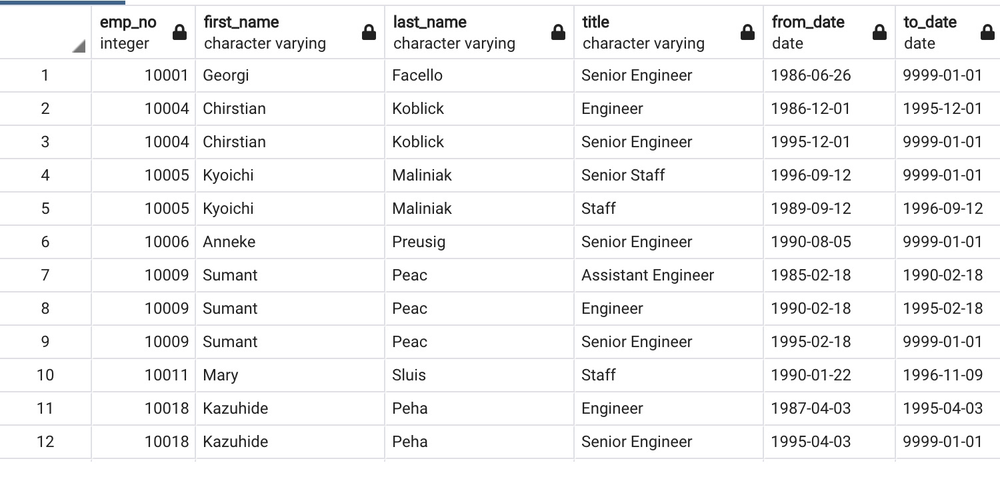
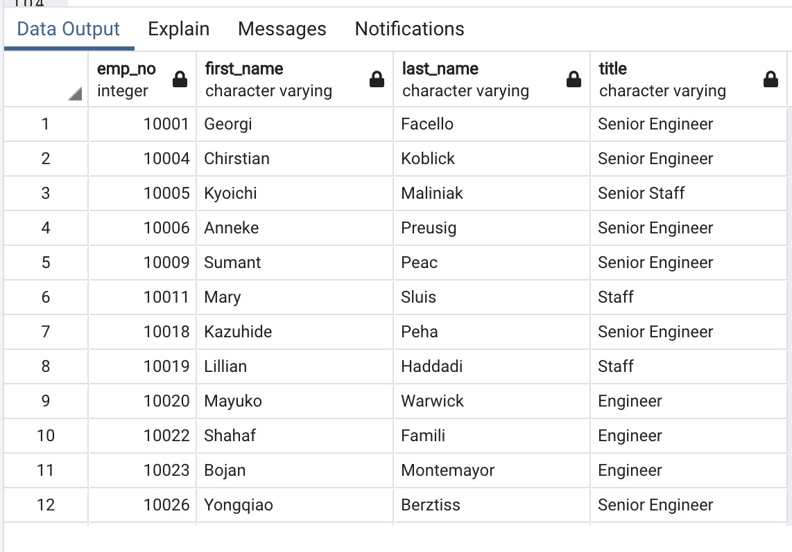
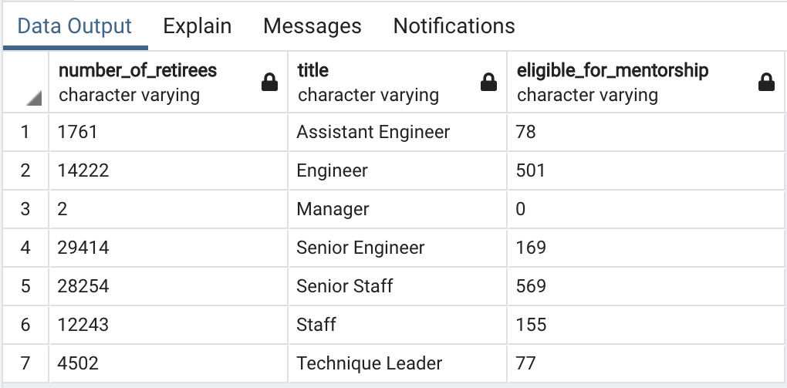

# Pewlett_Hackard_Analysis
Module 7 - UCB Bootcamp Employee Database with SQL

# Overview of the Analysis
The purpose of the study is to determine the number of retiring employees per title as well as identify employees who are eligible for mentorship in the company.

# Results
## Retiring Employees
* Several employees have been promoted during their stay in the company .This can be seen with the multiple entries/repeated entries of employee numbers(emp_no) in the retirement_titles.csv as seen below. 

* After removing the duplicate entries of employees from the previous table, it show us that there are 90,398 employees retiring within the next four years

## Job Titles that will be left Vacant
* There are several  job titles from each of the  different departments that need to be filled as the employees retire. The positions that will be left vacant have varying numbers. A majority of the retirees are Senior Engineers and Senior Staff. The table provided below shows the positions that will be vacated, in terms of the number of positions available in descending order.

## Employees Eligible for Mentorship
* After filtering the data based on the birthdate and the year 1965, we were also able to create a table showing employees that were eligible for mentorship. I believe 

# Summary
If retirement was solely based on birthdates (1952-1955), the company would have a total of 90,398 employees with titles retiring within the next four years. 

There are not that many employees eligible for mentorship for the titles that need to be filled. An example would be for the Manager position. Human Resources would probably need to develop or fast track its employee training and development to meet the company’s needs or to hire suitable candidates for soon-to-be vacated positions externally. Hopefully, the data provided in the other tables can help HR prioritize what positions need to have trainees, whether promoted internally or hired externall, as soon as possible; the dates on the necessary tables, just need to be arranged chronologically.

The table below shows the titles that will be left vacant with the number of retirees leaving on the left and the number of employees eligible for mentorship on the right. The query I used to come up with the table is also included below.  

